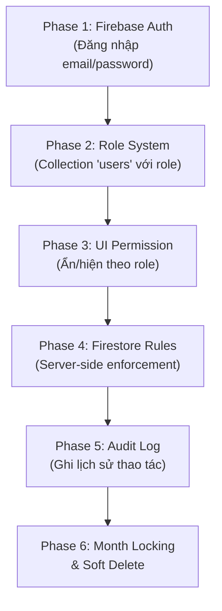

# 📊 Phân Tích Hệ Thống Dashboard — Thiếu gì để dùng lâu dài?

## Bối cảnh hiện tại

Hệ thống web hiện tại gồm 2 phần chính:
1. **Dashboard phân tích giao dịch** (`/dashboard/`) — xem, thêm/sửa/xóa khách hàng, ghi sản lượng theo ngày
2. **Hệ thống ôn thi / quiz** (`/admin/`, `/user/`, `/knowledge/`, `/results/`) — quản lý câu hỏi, bộ đề, thi thử

Hiện tại **KHÔNG có bất kỳ hệ thống phân quyền nào**. Mọi thứ đều "ai vào cũng được" hoặc chỉ chặn bằng 1 mật khẩu chung duy nhất.

---

## 🔴 Vấn đề nghiêm trọng nhất: Bảo mật & Phân quyền

### 1. Xác thực (Authentication) — Hiện tại quá yếu

| Hiện trạng | Vấn đề |
|---|---|
| `auth.js` dùng **1 mật khẩu SHA-256 cố định** cho tất cả | Ai biết mật khẩu = full quyền |
| Mật khẩu hash nằm ngay trong code client-side | Có thể brute-force offline |
| Session lưu bằng `sessionStorage`/`localStorage` | Không có token, không expire, không revoke được |
| `/admin/` **không có auth gì cả** | Bất kỳ ai biết URL đều vào được admin |
| `/user/` **không có auth gì cả** | Ai cũng có thể thi, nhập tên bất kỳ |

> [!CAUTION]
> Hệ thống admin quản lý câu hỏi, bộ đề, analytics — hoàn toàn **mở toang** không có bảo vệ nào.

### 2. Phân quyền (Authorization / RBAC) — Chưa tồn tại

Hiện tại **không có khái niệm role** nào trong hệ thống.

**Đề xuất mô hình role cần thiết:**

| Role | Quyền Dashboard | Quyền Quiz/Admin |
|---|---|---|
| 🔴 **Admin** (Quản lý) | Full: Xem + Thêm/Sửa/Xóa KH + Ghi sản lượng + Cài đặt | Full: Quản lý câu hỏi, bộ đề, xem kết quả, chấm bài |
| 🟡 **Staff** (Nhân viên) | Xem tổng quan + Ghi sản lượng **chỉ KH của mình** | Làm bài test, xem kết quả bản thân |
| 🟢 **Viewer** (Sếp/Giám sát) | Xem tất cả, xuất CSV. **Không** được sửa/xóa/thêm | Xem kết quả tất cả nhân viên |

> [!IMPORTANT]  
> Cần quyết định: Bạn muốn dùng **Firebase Authentication** (đăng nhập bằng email/password, Google account...) hay vẫn muốn giữ kiểu "nhập mật khẩu chung" nhưng phân cấp nhiều mật khẩu khác nhau?

### 3. Firestore Security Rules — Hiện tại chắc chắn đang mở

Vì code đọc/ghi Firestore trực tiếp từ client-side mà không có Firebase Auth, rất có thể Firestore rules đang ở chế độ:
```
allow read, write: if true;
```
→ **Bất kỳ ai biết project ID đều có thể đọc/ghi/xóa toàn bộ dữ liệu**.

---

## 🟡 Thiếu sót cho mục tiêu "ghi sản lượng lâu dài"

### 4. Audit Log (Nhật ký thao tác) — Chưa có

Khi nhiều người cùng sửa dữ liệu sản lượng, cần biết:
- **Ai** đã sửa sản lượng ngày nào, của khách nào
- **Giá trị cũ** → **giá trị mới** là gì
- **Thời điểm** sửa

Hiện tại `saveDayTransaction()` ghi thẳng vào Firestore mà **không lưu lịch sử** gì cả. Nếu ai đó ghi nhầm hoặc cố ý sửa sai → không truy vết được.

### 5. Data Validation — Chưa có

- Không có kiểm tra giá trị hợp lệ (có thể nhập số âm, số cực lớn)
- Không giới hạn ai được ghi vào KH nào (nhân viên A có thể sửa KH của nhân viên B)
- Không có cơ chế "khóa tháng" — tháng đã qua vẫn có thể bị sửa bất kỳ lúc nào

### 6. Backup & Recovery — Chưa có

- Không có cơ chế backup dữ liệu
- Nếu ai đó xóa nhầm KH hoặc sản lượng → mất vĩnh viễn
- Cần ít nhất chức năng "Soft Delete" (đánh dấu xóa thay vì xóa thật)

---

## 🟢 Cải thiện UX cho dùng lâu dài

### 7. Cấu trúc Firestore — Cần review

Hiện tại: Mỗi document `analytics_sheets` chứa **toàn bộ mảng customers** dưới dạng 1 array lớn.

| Vấn đề | Hệ quả |
|---|---|
| Array lớn trong 1 document | Mỗi lần sửa 1 KH phải đọc/ghi lại **toàn bộ** document |
| Firestore document limit: 1MB | Khi dữ liệu lớn lên → vượt limit |
| Concurrent edit conflicts | 2 người sửa cùng lúc → người sau ghi đè người trước |

> [!NOTE]
> Đây không phải vấn đề cấp bách nếu số KH < vài trăm/máy, nhưng về lâu dài cần tách mỗi KH thành 1 sub-document riêng.

### 8. Chức năng còn thiếu cho dùng production

| Chức năng | Mô tả | Độ ưu tiên |
|---|---|---|
| **Đăng nhập riêng từng người** | Firebase Auth (email/password) | 🔴 Cao |
| **Phân quyền UI** | Ẩn/hiện nút Thêm/Sửa/Xóa theo role | 🔴 Cao |
| **Firestore Rules** | Chặn đọc/ghi trái phép ở server-side | 🔴 Cao |
| **Audit trail** | Ghi log ai sửa gì, khi nào | 🟡 Trung bình |
| **Khóa tháng cũ** | Ngăn sửa dữ liệu tháng đã kết thúc | 🟡 Trung bình |
| **Soft Delete** | KH bị xóa có thể khôi phục | 🟡 Trung bình |
| **Export/Import Excel** | Admin upload Excel → hệ thống parse | 🟢 Đã có (admin/analytics) |
| **Thông báo realtime** | Toast notification khi có người sửa dữ liệu | 🟢 Thấp |

---

## Open Questions — Cần bạn trả lời

1. **Số lượng user dự kiến?** Bao nhiêu admin, bao nhiêu staff, bao nhiêu viewer?
2. **Kiểu đăng nhập:** Bạn muốn mỗi người có **tài khoản riêng** (email + mật khẩu) hay vẫn muốn dùng kiểu "mật khẩu chung"?
3. **Tách Dashboard và Quiz?** Dashboard giao dịch và Hệ thống Quiz có cần phân quyền chung (cùng 1 hệ thống user) hay tách biệt?
4. **Khóa tháng cũ:** Có muốn khóa không cho sửa dữ liệu tháng đã qua không?
5. **Mức độ ưu tiên:** Bạn muốn làm ngay phần nào trước? (Auth → RBAC → Audit log → ...)

---

## Đề xuất thứ tự triển khai



Mỗi phase khoảng **1 buổi code** nếu làm tuần tự. Phase 1-3 là **bắt buộc** nếu muốn nhiều người dùng chung mà không lo dữ liệu bị phá.
